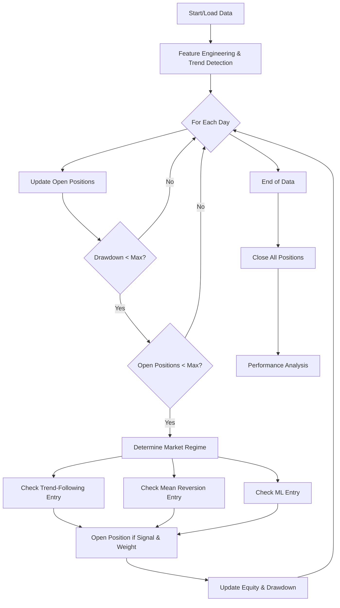

# Adaptive Multi-Strategy Trading System:

## Overview

This trading system is an **adaptive, multi-strategy algorithm** that dynamically combines trend-following, mean reversion, and machine learning-based signals. It is designed to robustly trade across different market regimes by analyzing price, momentum, volatility, and volume features, and by adjusting its behavior based on market conditions detected in real time.

---

## Feature Engineering and Market Regime Detection

The strategy begins by constructing a rich set of features from price and volume data:

- **Exponential Moving Averages (EMA):** Calculated for 20, 50, and 100 periods to capture short-, medium-, and long-term trends.
- **EMA Slopes:** Measures the rate of change of EMAs, emphasizing recent changes for trend strength.
- **EMA Crossovers:** The difference between EMAs (e.g., 20 vs. 50) is used as a trend signal.
- **Relative Strength Index (RSI):** With exponential weighting, to measure momentum and overbought/oversold conditions.
- **ADX:** Average Directional Index, for trend strength.
- **ATR \& ATR%:** Average True Range and its percentage, to capture volatility.
- **Volume Ratio:** Current volume relative to its EMA, to confirm price moves.
- **Trend Scores:** Aggregated from multiple timeframes and confirmed by RSI and ADX to classify each day as:
    - 0: Very Bearish
    - 1: Bearish
    - 2: Neutral
    - 3: Bullish
    - 4: Very Bullish

---

## Core Trading Strategies

### 1. Trend-Following

- **Entry (Long):**
    - Market regime is Bullish or Very Bullish (`trend_class` 3 or 4)
    - ADX > 25 (strong trend)
    - RSI > 50 (momentum confirms uptrend)
    - 20 EMA above 50 EMA (`ema_cross_20_50` > 0)
- **Entry (Short):**
    - Market regime is Bearish or Very Bearish (`trend_class` 0 or 1)
    - ADX > 25
    - RSI < 50
    - 20 EMA below 50 EMA (`ema_cross_20_50` < 0)

### 2. Mean Reversion

- **Entry (Long):**
    - Market regime is Bearish or Neutral (`trend_class` 1 or 2)
    - RSI < 30 (oversold)
    - Price is well below 20 EMA (`price_to_ema20` < -0.02)
    - ADX < 25 (weak trend/range-bound)
- **Entry (Short):**
    - Market regime is Neutral or Bullish (`trend_class` 2 or 3)
    - RSI > 70 (overbought)
    - Price is well above 20 EMA (`price_to_ema20` > 0.02)
    - ADX < 25

### 3. Machine Learning-Based

- **Entry (Long):**
    - ML model predicts upward movement (`direction_pred` == 1 or `ml_signal` > 0.5)
- **Entry (Short):**
    - ML model predicts downward movement (`direction_pred` == 0 or `ml_signal` < -0.5)
      
## How the ML-Based Model Works

### 1. Feature Preparation

- Uses technical indicators and engineered features:
  - RSI, ADX, ATR%, EMA slopes, price-to-EMA ratios, volume ratio, RSI/ADX slopes, day of week, month.
- Targets:
  - **Direction:** 5-day forward direction (`future_direction_5d`, binary: up or down).
  - **Magnitude:** 5-day forward return (`future_return_5d`, continuous).

### 2. Model Training

- **Random Forest Classifier:** Predicts the probability of price moving up or down (`direction_pred`).
- **Gradient Boosting Regressor:** Predicts the expected return magnitude (`magnitude`).
- Features are standardized before training. Models are trained on historical data and validated for accuracy.

### 3. Signal Generation

- For each new bar:
  - The classifier outputs `direction_pred` (1 for up, 0 for down).
  - The regressor outputs `magnitude`.
  - A composite `ml_signal` is computed:  
    `ml_signal = direction_prob * magnitude * 100`
    - This combines directional confidence and expected move size.

### 4. Trade Execution

- **Long Entry:**  
  If `direction_pred == 1` or `ml_signal > 0.5`
- **Short Entry:**  
  If `direction_pred == 0` or `ml_signal < -0.5`
- Position size and risk are dynamically adjusted based on model confidence and volatility.
- **Exits:**  
  - Signal reversal (model flips direction)
  - Stop-loss/take-profit hit
  - Maximum holding period reached

### 5. Integration

- ML-based trades are blended with trend-following and mean-reversion strategies.
- The probability of taking an ML-based trade is adapted to the current market regime.

---

## Summary Table

| Step               | Details                                                        |
|--------------------|---------------------------------------------------------------|
| Features           | RSI, ADX, ATR%, EMA slopes, price/EMA, volume, day, month     |
| Targets            | 5-day direction (binary), 5-day return (continuous)           |
| Models             | Random Forest Classifier, Gradient Boosting Regressor         |
| Entry (Long)       | `direction_pred == 1` or `ml_signal > 0.5`                    |
| Entry (Short)      | `direction_pred == 0` or `ml_signal < -0.5`                   |
| Position Sizing    | Adjusted by model confidence and volatility                   |
| Exits              | Signal reversal, stop-loss, take-profit, max holding period   |

---
---

## Position Sizing and Risk Management

- **Base Risk:** 1% of capital per trade, adjusted by strategy and volatility.
- **Max Risk:** 3% of capital per trade.
- **Max Drawdown:** Trading is paused if drawdown exceeds 15%.
- **Max Positions:** Up to 5 simultaneous open positions.
- **Profit Target and Stop Loss:**
    - Set as multiples of ATR, with different ratios for each strategy (e.g., trend-following uses a higher risk-reward ratio).
- **Trailing Stop:**
    - Dynamically tightened as profit increases, with logic tailored to each strategy and ML signal confidence.

---

## Trade Execution Logic

### Trade Entry

On each trading day:

- The system determines the current **market regime** using the trend classification.
- It consults the **strategy weights** for that regime, which dictate the probability of acting on each strategy.
- For each strategy:
    - If entry conditions are met and a random draw (to simulate diversification and avoid overfitting) is below the regime's weight for that strategy, a trade is opened.
    - Position size is calculated based on risk, volatility, and current drawdown.

### Trade Exit

Positions are closed when **any** of the following occurs:

- **Stop Loss:** Price hits the trailing stop.
- **Take Profit:** Price hits the profit target.
- **Strategy-Specific Exit:**
    - Trend-following: Trend reverses (e.g., bullish position turns bearish).
    - Mean reversion: Price returns to the mean (crosses back above/below 20 EMA).
    - ML-based: ML signal reverses.
- **Time Exit:** Maximum holding period exceeded (varies by strategy).
- **End of Backtest:** All open positions are closed at the final price.

---

## Market Regime Adaptation

The system adapts its behavior based on detected market regime:

| Regime | Trend-Following | Mean Reversion | ML-Based |
| :-- | :-- | :-- | :-- |
| Very Bearish | 20% | 60% | 20% |
| Bearish | 30% | 50% | 20% |
| Neutral | 30% | 40% | 30% |
| Bullish | 50% | 30% | 20% |
| Very Bullish | 60% | 20% | 20% |

This ensures the system emphasizes mean reversion in ranges and trend-following in strong trends, while always allowing for ML-based trades.

---

## Performance Monitoring

- **Equity Curve:** Tracks capital over time, including unrealized P\&L.
- **Drawdown Calculation:** Monitors risk and halts new entries if drawdown exceeds threshold.
- **Trade Logging:** Every trade records entry/exit, size, P\&L, strategy, regime, and exit reason.
- **Post-Trade Analytics:**
    - Win rate, Sharpe/Sortino ratios, profit factor, max drawdown, average hold, and breakdowns by strategy and regime.

---

## Summary Table of Trade Conditions

| Strategy | Entry (Long) Conditions | Entry (Short) Conditions | Exit Conditions |
| :-- | :-- | :-- | :-- |
| Trend-Following | Bullish regime, ADX>25, RSI>50, 20EMA>50EMA | Bearish regime, ADX>25, RSI<50, 20EMA<50EMA | Trend reversal, stop loss, take profit, max hold (20 days) |
| Mean Reversion | Bearish/Neutral, RSI<30, Price<20EMA-2%, ADX<25 | Neutral/Bullish, RSI>70, Price>20EMA+2%, ADX<25 | Price crosses 20EMA, stop loss, take profit, max hold (10 days) |
| ML-Based | ML predicts up (`direction_pred`==1 or `ml_signal`>0.5) | ML predicts down (`direction_pred`==0 or `ml_signal`<-0.5) | ML prediction reverses, stop loss, take profit, max hold (15 days) |

---

## Execution Flow Diagram

---

## Key Takeaways

- **Multi-layered Signal Confirmation:** No single indicator triggers a trade; multiple confirmations reduce false signals.
- **Dynamic Adaptation:** Strategy weights shift based on real-time market regime, improving robustness.
- **Comprehensive Risk Controls:** Position sizing, max positions, drawdown limits, and dynamic trailing stops are all in place.
- **Machine Learning Integration:** ML signals are blended with classic technical analysis for improved predictive power.
- **Extensive Logging and Analytics:** Every trade and equity movement is tracked for deep performance analysis.

---

This adaptive, multi-strategy system is designed for robust, real-world trading, balancing risk and reward by blending classic technical analysis and modern machine learning, all while adapting to the ever-changing market environment.

